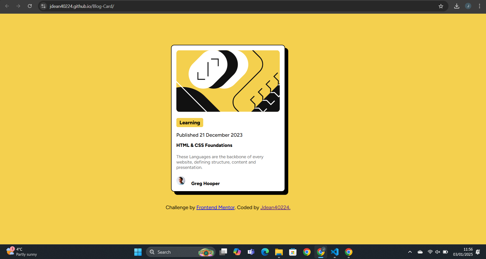

# Frontend Mentor - Blog preview card solution

This is a solution to the [Blog preview card challenge on Frontend Mentor](https://www.frontendmentor.io/challenges/blog-preview-card-ckPaj01IcS). Frontend Mentor challenges help you improve your coding skills by building realistic projects. 

## Table of contents

- [Overview](#overview)
  - [The challenge](#the-challenge)
  - [Screenshot](#screenshot)
  - [Links](#links)
- [My process](#my-process)
  - [Built with](#built-with)
  - [What I learned](#what-i-learned)
  - [Continued development](#continued-development)
  - [Useful resources](#useful-resources)
- [Author](#author)

## Overview

### The Challenge

Users should be able to:

- See hover and focus for all interactive elements on the page.

### Screenshot

### Links 

- Solution URL:[]

- Live Site URL:[https://jdean40224.github.io/Blog-Card-Front-End/]

## My Process

### Built with

- Semantic HTML5 markup
- CSS custom properties
- Flexbox
- CSS Grid

### What I learned

Through out this project I learned a basic understanding of how to use width properly flex box, and how to place an image on the same block with text.

### Useful Resources

[Width](https://developer.mozilla.org/en-US/docs/Web/CSS/width) - It is a useful article that helped me with using width in css.

## Author

Website - [Github](https://github.com/jdean40224)

Frontend Mentor - [jdean40224](https://www.frontendmentor.io/profile/jdean40224)